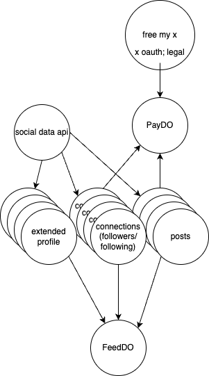

https://github.com/janwilmake/x-dorm-template
https://github.com/janwilmake/x-oauth-middleware

- https://oapis.org/summary/socialdata.tools/getTwitterUserFollowers
- https://oapis.org/summary/socialdata.tools/getTwitterUserFollowing

Make a Cloudflare worker using typescript that:

1. when given GET /{username} it starts the initial via queue or returns whatever is in kv

2. for all users done, it has a daily cronjob to update the kv

**Followers Strategy**:

- New followers appear at the beginning of the list (reverse chronological)
- Store the most recent follower's ID from your last update
- Fetch pages until you encounter previously stored followers
- Compare with stored list to identify unfollowers

**Following Strategy**:

- Similarly, new accounts followed appear first
- Use the same approach as with followers

https://uithub.com/janwilmake/gists/blob/main/js-cloudflare-worker.js
https://uithub.com/janwilmake/gists/blob/main/named-codeblocks.md

##

Ok ok just do it this is gonna be epic... exposing a 100% secure and up-to-date sql db for all your tweets!!!

If I get to that point, I can also create a fully new twitter UI. just use `remote-sqlite-cursor` on the client :) sick!

After that we can start making feedDOs that fetch tweets from other DOs. Now it will become interesting. A marketplace of ideas!!!! A time machine!!!! ❤️

To keep it simple, simply work with direct payment for now and do nothing for free... Freemium isn't important if the vp is clear. Free part can sit elsewhere.
